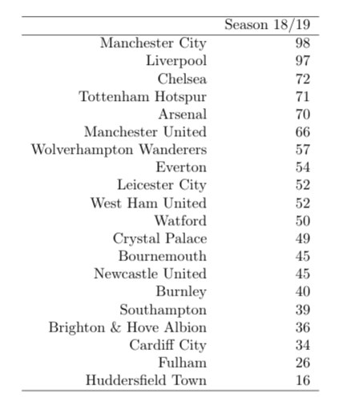
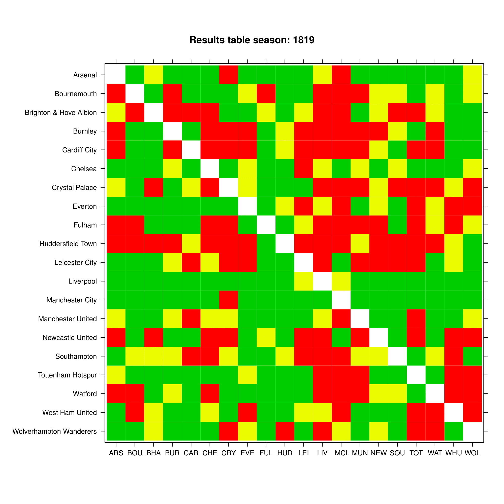
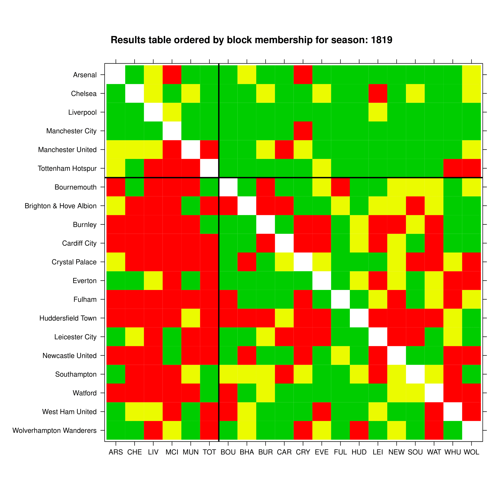
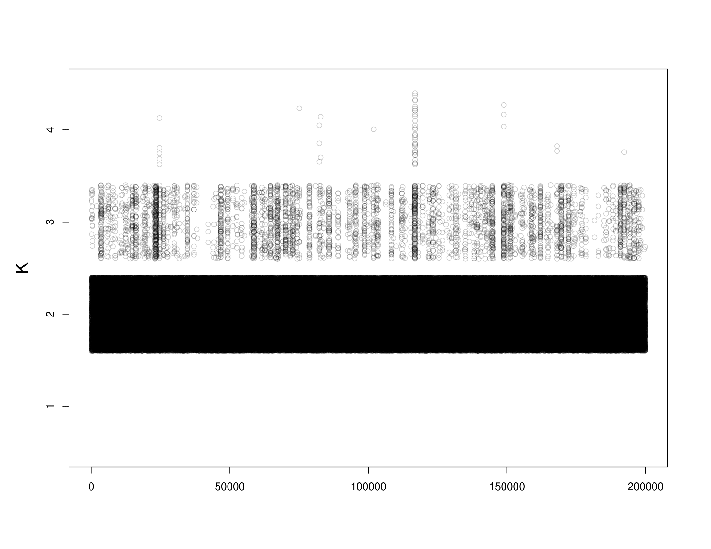
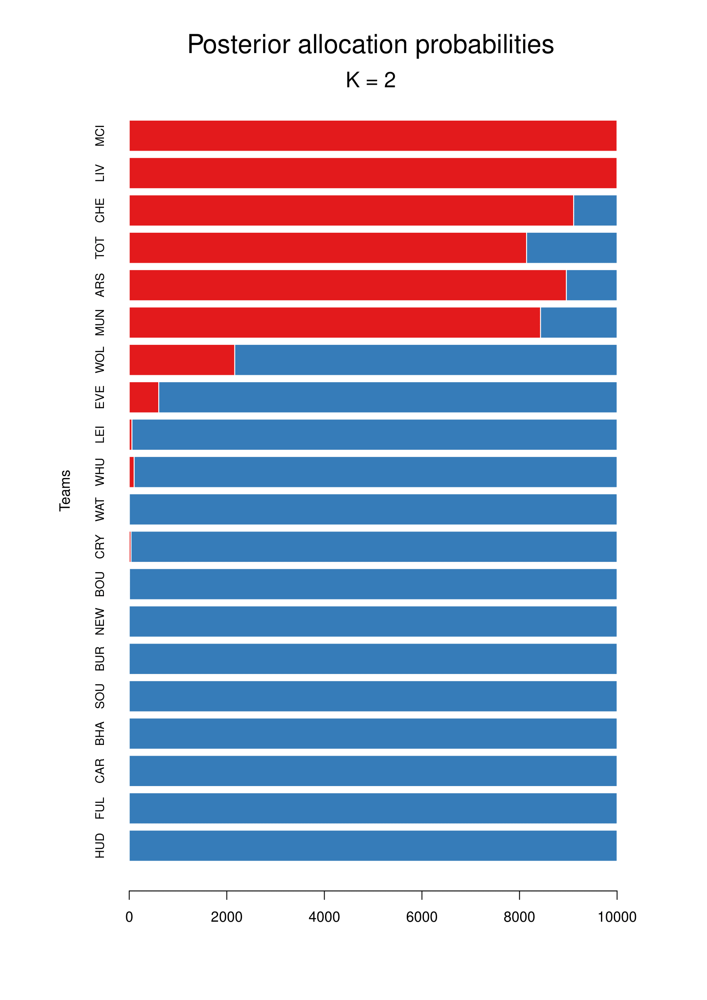
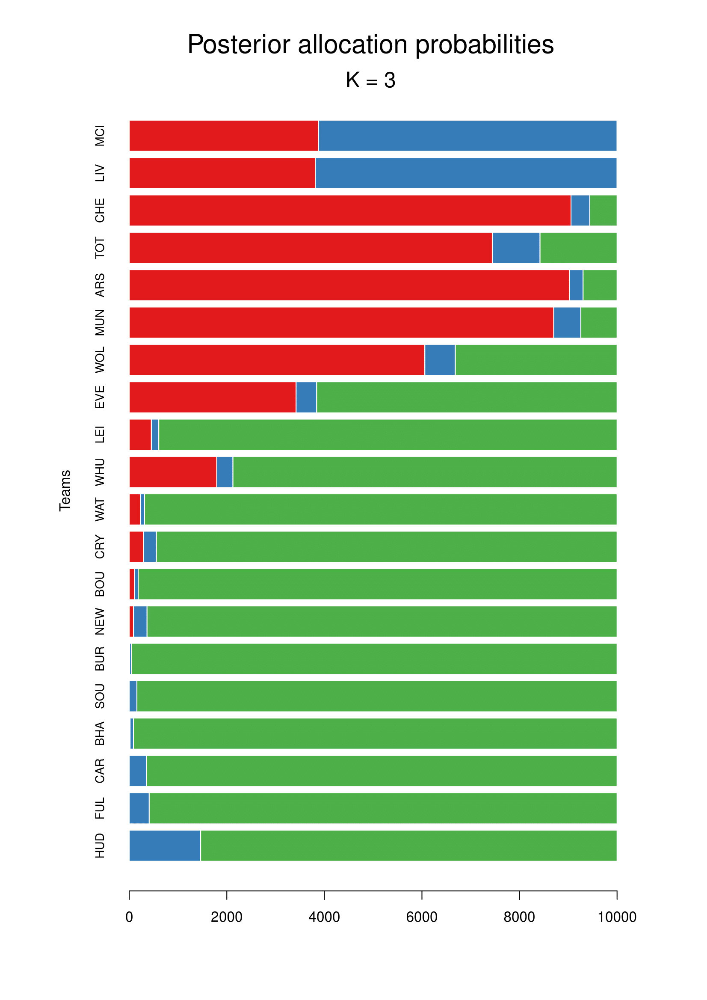
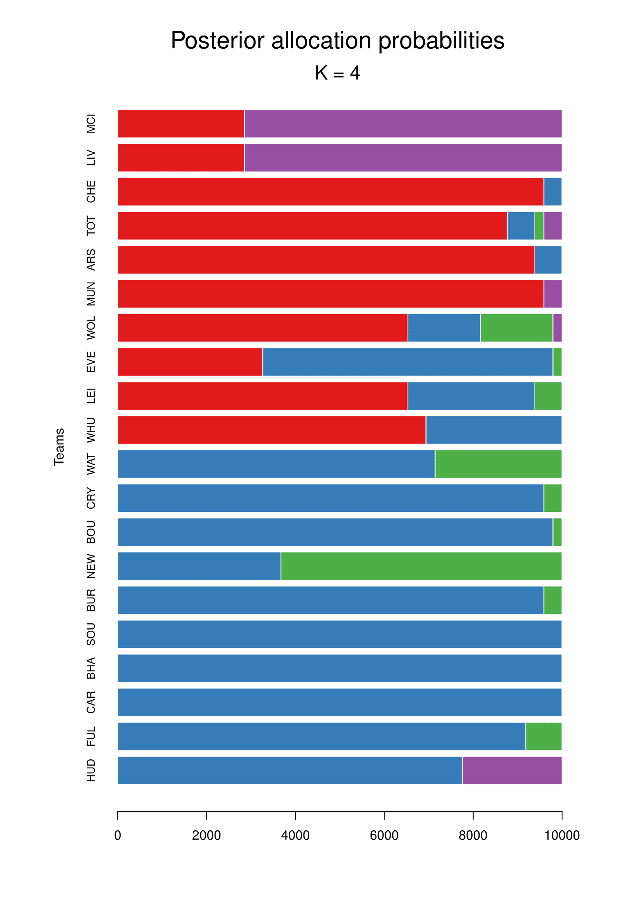
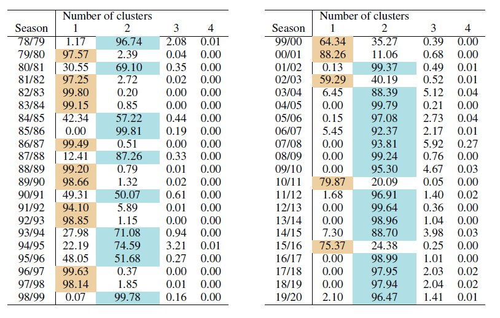
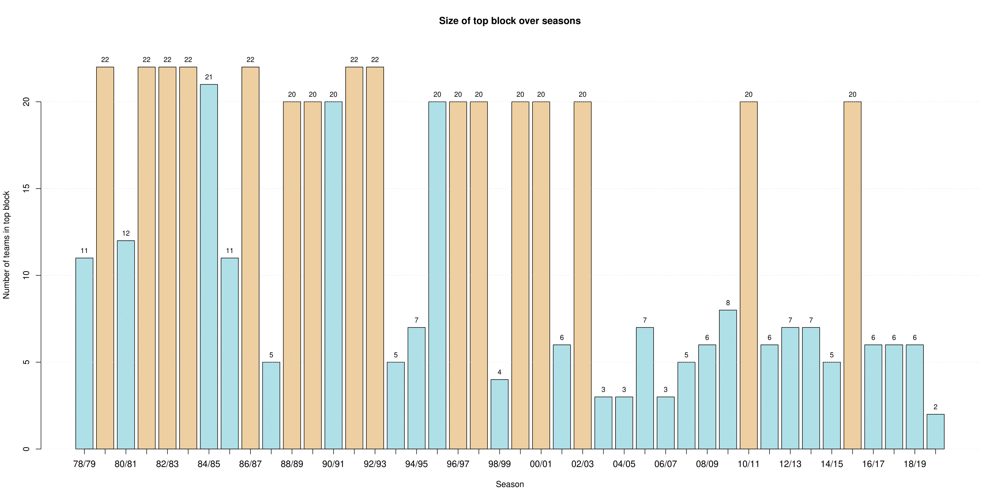
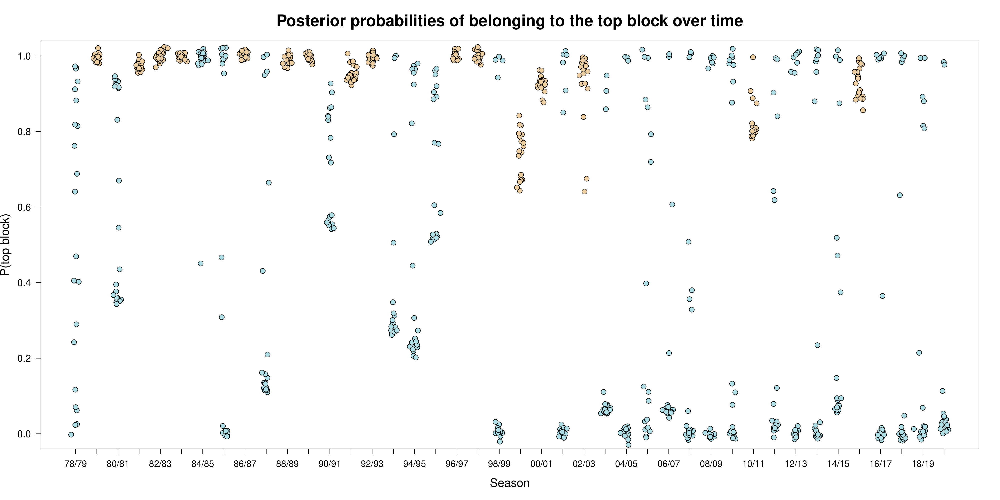

# Football_SBM (2021)

This repository contains the data and code associated with the article/preprint by *F. Basini, V. Tsouli, I Ntzoufras, N. Friel*,
*"Assessing competitive balance in the English Premier League for over forty seasons using a stochastic block model" (2021)*, currently deposited in [arXiv?].

## Repository structure:  

* ```README.md``` - you're reading it
* [/Data_Premier](https://github.com/basins95/Football_SBM/tree/master/Data_Premier) - contains the tables of results (match grids) of the Premier League championship from season 1978/79 to 2019/20 in csv format. e.g. *Result_Premier_0102.csv* for season 2001/02.
	* Note on the data: each csv file contains the results table where entries of the main diagonal are blank and the entry of match results is written as | 4~3 | for a match won 4 to 3 by row team against col team, where row team is playing home.
* [```LABEL_CORRECTION_AND_ANALYSIS.R```](https://github.com/basins95/Football_SBM/blob/master/LABEL_CORRECTION_AND_ANALYSIS.R) - code to apply the label switching algorithm (```collpcm```) and carry out post-hoc analysis of the chain.
* [```SBM_FUNCTIONS.R```](https://github.com/basins95/Football_SBM/blob/master/SBM_FUNCTIONS.R) - contains all functions used in the MCMC algorithm. e.g. *get_loglik* returns the collapsed loglikelihood.
* [```READ_TABLE_RESULTS.R```](https://github.com/basins95/Football_SBM/blob/master/READ_TABLE_RESULTS.R) - code to load the result table and extract the relational pattern **y**.
* [```MCMC_main.R```](https://github.com/basins95/Football_SBM/blob/master/MCMC_main.R) - the heart (:heartpulse:) of the whole code which calls the other source files and runs the MCMC algorithm.
* [/Inference_results](https://github.com/basins95/Football_SBM/tree/master/Inference_results) - now empty, folders for each season analysed will be created inside this folder once the code is run, e.g. [/Inference_results/mcmc_Premier_Season_0102] for season 2001/02.
* [```OVER_TIME_ANALYSIS.R```](https://github.com/basins95/Football_SBM/blob/master/OVER_TIME_ANALYSIS.R) - script to run the analysis for all the season in the data folder and to produce the analysis of top block probability over time and the associated plots.


## Usage
* Clone repository.
#### To analyse one season at a time
---------------------------------------
* Open ```MCMC_main.R``` in RStudio and set ```Football_SBM``` as your working directory.
* Uncomment ```line 29``` and set ```season``` to the season you want to analyse using the last two digits of each year, e.g. "1819" for 2018/19. (Provided that it is between 1978/79 and 2019/20)
``` r
season = "1819"
```
* Run it all.
*Waiting time: about 4 minutes*

---------------------------------------


#### To analyse all seasons altogether
---------------------------------------
* Open ```OVER_TIME_ANALYSIS.R``` in RStudio and set ```Football_SBM``` as your working directory.
* Run it all.
*Waiting time: about 2 and a half hours*

---------------------------------------

## Results
In the associated folder ```/Inference_results/mcmc_Premier_Season_*season*``` that will be created, the following items will be available:

<table> <col width="5"> <col width="400">
		<tr>
								 <td> <b>File name and description </b> </ td>
								 <td> <b> Output</b> </ td>
	 </tr>
	 <tr> 	
	 							<td> <li><code>FinalTable_Premier_Season_*season*_*iter*k_seed_*seed*.txt</code><br> is the final league table for the season, in latex format. </td>
								<td>   </td>
	 </tr>
	 <tr> 	
	 							<td> <li><code>Heatmap_Season_*season*.pdf</code><br> the match grid of the season with results categorised by colour. </td>
								<td>   </td>
	 </tr>
	 <tr> 	
	 							<td> <li><code>Heatmap_Estimated_Season_*season*.pdf</code><br> the permuted match grid of the season, from *a posteriori* analysis, with teams listed according to the most likely block membership, results categorised by colour. This file is saved only when the MAP for K is larger than 1. </td>
								<td>   </td>
	 </tr>
	 <tr> 	
	 							<td> <li><code>Ktrue_NF_Premier_Season_*season*_*iter*k_seed_*seed*.pdf </code><bt> is the jittered traceplot of K as plotted in Nobile and Fearnside (2007). </td>
								<td>    </td>
	 </tr>
		<tr>
								 <td colspan = "1"> For each value of K (number of clusters) predicted:</ td>    
		</tr>
		<tr>
								 <td colspan = "2"> <li> <code>Summary_table_Premier_Season_season_iterk_seed.txt </code><br> is the table of posterior allocations of the teams in the league, in latex table format.
								 <p align="center">
								  
									</p>
									</ td>    
		</tr>
		<tr>
								 <td colspan = "2"> <li> <code>StackedPlot_Premier_Season_*season*_*iter*k_seed_*seed*.pdf</code> <br>is the stacked plot of posterior allocations of the teams in the league ordered by the final ranking to the associated Summary_table.
								 <p align="center" float="left">
									 
									 
									 
								 </p>
									</ td>    
		</tr>
		<tr>
								 <td colspan = "2"> Also:<br>
								 <li> <code> WS_Premier_Season_*season*_*iter*k_seed_*seed*.RData </code> the whole workspace is saved at the end of the analysis.</ td>    
		</tr>
</table>


In addition, if you are using ```OVER_TIME_ANALYSIS.R```, there will be one futher directory ```mcmc_Premier_OVER_TIME_ANALYSIS```, which will contain:
* ```mcmc_Premier_OVER_TIME.RData``` the workspace regarding the over time analysis.
* ```Posterior_K_table_OVER_TIME.txt``` the table with posterior probability of K over each season.
<p align="center">

</p>
* ```Size_top_block_table.txt``` the table with size of the estimated top block over each season.
* ```TopBlock_Size_barplot.pdf``` the barplot showing the value of the size of the estimated top block over each season.
<p align="center">

</p>
* ```TopBlock_prob_datapoints_JITTERED.pdf``` the plot of the probability of being in the top block for all teams in the league and over all seasons.
<p align="center">

</p>
* ```\Over_time_Teams``` folder containing the probability of belonging to the top block over each season but focusing on one team at a time (see Fig. 8 of the paper). Below we provide an example for Manchester City:
<p align="center">

</p>

## Dependencies:
All packages used are available on CRAN.
* #### Data wrangling:
```
install.packages("plyr")
install.packages("stringi")
install.packages("seqinr")
```
* #### Plotting:
```
install.packages("RColorBrewer")
install.packages("lattice")
```
* #### Printing tables in Latex format:
```
install.packages("xtable")
```
* #### Algorithm to adjust for label switching:
```
install.packages("collpcm")
```
Jason Wyse and Caitriona Ryan (2019). collpcm: Collapsed Latent Position Cluster Model
  for Social Networks. R package version 1.1. <https://CRAN.R-project.org/package=collpcm>
